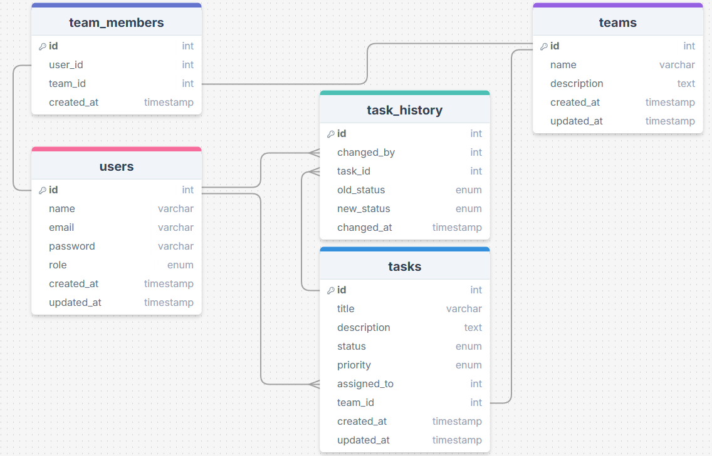

# [**Gerenciador de tarefas - API RocketTasks**](https://efficient-sloth-d85.notion.site/Desafio-pr-tico-Gerenciador-de-tarefas-0107c46e7aaa44fa8f01f879589a9077)

API para um sistema Gerenciador de tarefas, onde os usuários podem criar contas, autenticar-se e gerenciar tarefas. As tarefas podem ser atribuídas a membros do time, categorizadas por status e prioridade, e acompanhadas.

### **Tecnologias e Recursos:**

- **Backend Node.js:**
    - Framework: Express.js
    - Banco de dados: PostgreSQL
    - ORM: Prisma
- **Testes:**
    - Framework de testes: Jest
- **Deploy:**
    - Deploy do backend em **Render**.
- **Outros:**
    - Docker
    - TypeScript
    - Validação com Zod
    - JWT

### Funcionalidades da aplicação

**Autenticação e Autorização:**

- Deve ser possível criar uma conta e iniciar uma sessão.
- JWT para autenticação.
- Níveis de acesso:
    - **Administrador**: gerencia usuários e equipes.
    - **Membro**: gerencia tarefas atribuídas.

**Gerenciamento de Times:**

- Apenas o usuário admin pode criar e editar times.
- Apenas o usuário admin pode adicionar ou remover membros do time.

**Tarefas:**

- CRUD de tarefas (criar, ler, atualizar, deletar).
- Status: "Pendente", "Em progresso", "Concluído".
- Prioridade: "Alta", "Média", "Baixa".
- Atribuição de tarefas para membros específicos.

**Usuário Admin:**

- Visualizar e gerenciar todas as tarefas, usuários e times.

**Member:**

- Visualiza tarefas do time
- Pode editar apenas suas tarefas

### [**Exemplo de estrutura para o banco de dados**](https://drawsql.app/teams/vitor-elguesabal-de-paiva/diagrams/rockettasks)

Dos `ENUM`:

* **users.role:** 'admin', 'member';
* **tasks.status:** 'pending', 'in_progress', 'completed';
* **tasks.priority:** 'high', 'medium', 'low';
* **task_history.old_status:** 'pending', 'in_progress', 'completed';
* **task_history.new_status:** 'pending', 'in_progress', 'completed'.

